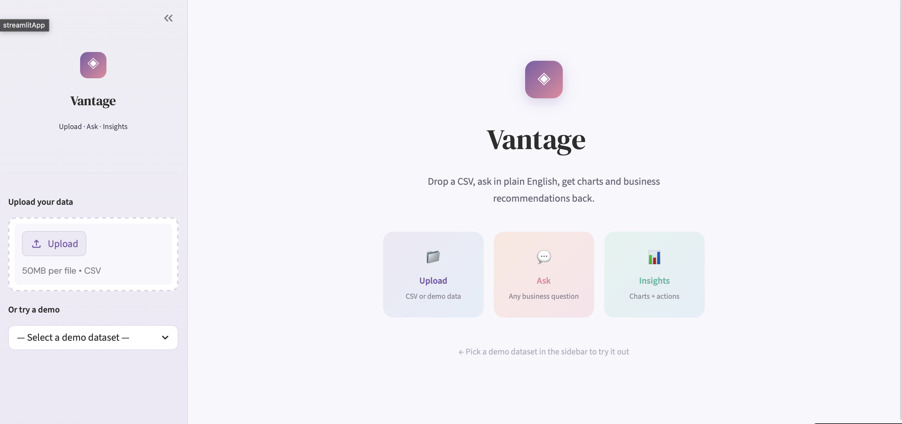
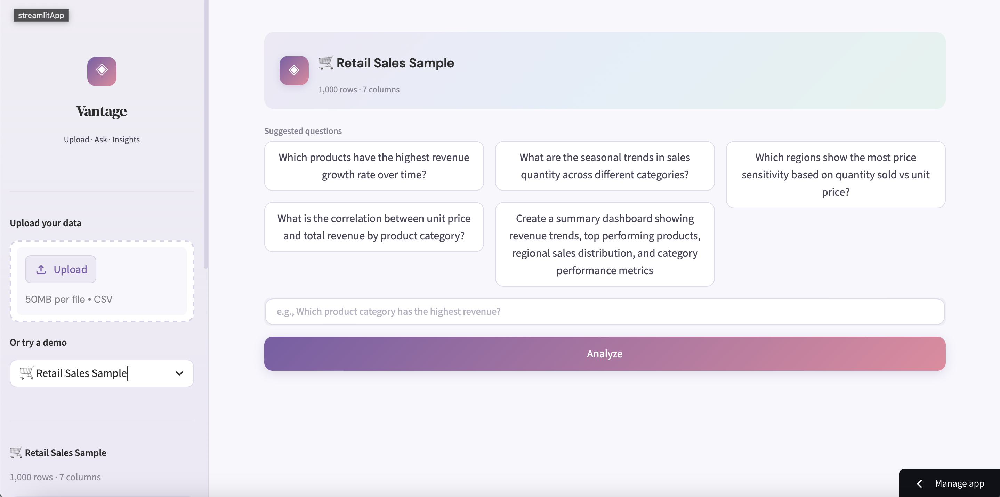
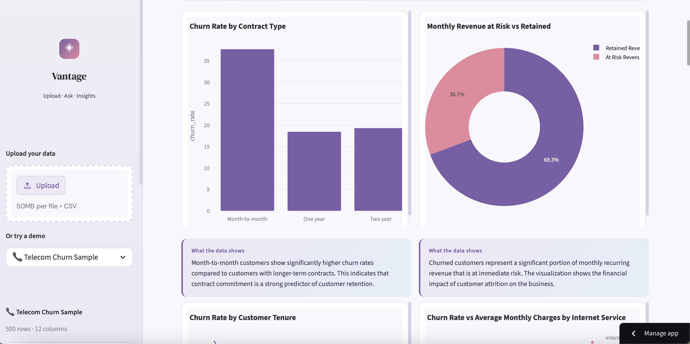

# ◈ Vantage — AI Analyst Agent on Claude API

[[Open in Streamlit](https://static.streamlit.io/badges/streamlit_badge_black_white.svg)](https://vantage-1910.streamlit.app)

Vantage is a Streamlit app I built to make CSV analysis easier for non-technical users.  
You upload a dataset, ask a question in plain English, and the app generates charts, insights, and business recommendations using Claude.

I built this because a lot of dashboard tools are useful only after setup, while most people just want quick answers from messy CSV files.

**[▶ Launch Vantage](https://vantage-1910.streamlit.app)** 

---

## What It Does

- Upload a CSV or use a demo dataset
- Ask natural-language business questions
- Generate charts and plain-English insights
- Suggest next-step recommendations

The AI handles the entire pipeline: understanding your question, writing analysis code, executing it against your dataset, choosing the right chart type, and translating the results into actionable business language.

---
## Screenshots

### Home Page

### Example Analysis

---

## Tech Stack

| Layer | Technology |
|-------|-----------|
| App Framework | Streamlit |
| AI / LLM | Anthropic Claude API (claude-sonnet-4-20250514) |
| Data Processing | pandas |
| Visualization | Plotly Express |
| Deployment | Streamlit Community Cloud |

---

## Why I built this
I wanted to explore whether an LLM could act like a lightweight business analyst for ad hoc CSV analysis, especially for users who are comfortable asking questions but not writing SQL or Python.

## Challenges
- making the model generate valid pandas code consistently
- choosing chart types automatically
- keeping outputs useful for business users, not just technically correct

## Limitations
- works best on clean tabular CSV data
- generated code execution is controlled, but not production-grade secure
- recommendations depend on data quality and question clarity

## Next improvements
- export insights to PDF / PowerPoint
- better guardrails for generated code
- support for multi-sheet Excel files
- saved dashboards and session history

---

**Heer Patel** · [heerpatel7016@gmail.com](mailto:heerpatel7016@gmail.com) · [heer1910.github.io](https://heer1910.github.io)
